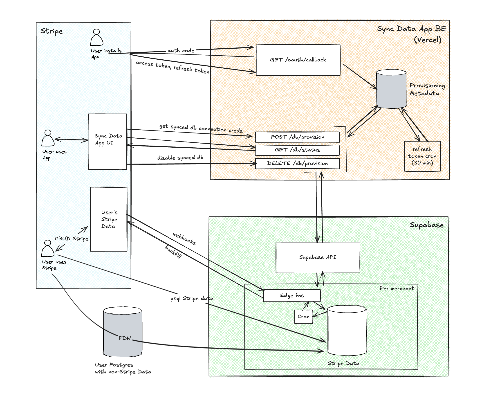

## sync-stripe-app

Stripe App that installs into a Stripe account, provisions a Supabase Postgres project, and installs the Stripe sync so Stripe data can land in Postgres.

### System overview

### Repo structure

- **`sync-app/`**: Stripe UI extension (Dashboard) to start provisioning, poll status, and show the provisioned DB connection string.
- **`backend/`**: Vercel serverless API for OAuth (`/install`, `/api/oauth/*`), provisioning (`/api/db/*`), and token refresh; persists encrypted tokens + provisioning state in a central Postgres DB.
- **`supabase-management/`**: Scheduled token refresh (Supabase cron + Edge Function) plus deployment SQL/scripts.

